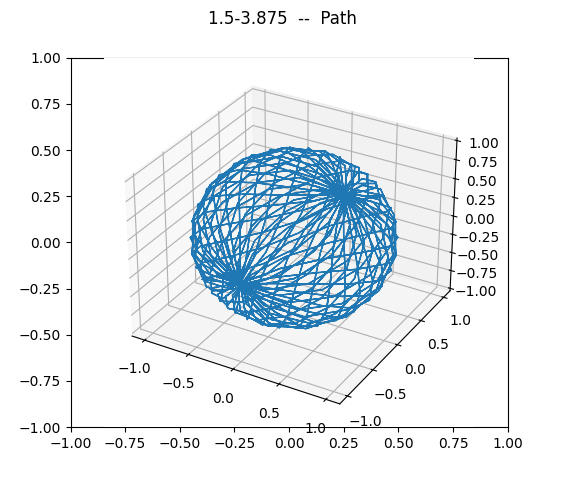

<!-- PROJECT LOGO -->
<br />
<div align="center">
  <a href="https://public.ksc.nasa.gov/partnerships/capabilities-and-testing/testing-and-labs/microgravity-simulation-support-facility/">
    
  </a>
</div>

## Computer Model

<div align="center">
  
</div>

This is a computer model that determines the optimal combination of inner and outer frame velocities to produce an effective microgravity simulation.

## Built With

[![Python][python-logo]](https://www.python.org/)

[python-logo]: https://img.shields.io/badge/Python-3776AB?style=for-the-badge&logo=python&logoColor=white

## Installation
To install the necessary dependencies, run:
```bash
pip install -r requirements.txt
```

## Usage
1. In `dataCompile.py`, set:
   - The time period of analysis (lines 16–17)
   - The inner and outer frame velocities (lines 38–39)

2. To start the simulation, run:
   ```bash
   python3 dataCompile.py
   ```

## Acknowledgments

This project was inspired by:

Clary JL, France CS, Lind K, Shi R, Alexander JS, Richards JT, Scott RS, Wang J, Lu X-H, and Harrison L (2022), Development of an inexpensive 3D clinostat and comparison with other microgravity simulators using Mycobacterium marinum. *Front. Space Technol.* 3:1032610. [doi: 10.3389/frspt.2022.1032610](https://doi.org/10.3389/frspt.2022.1032610)
